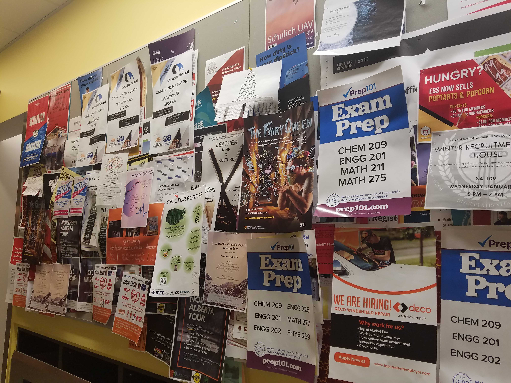

# Calgary Hacks 2020 - Event Connect
This project was created for Calgary Hacks 2020 by team :q! You can see a deployed version [here.](http://www.eventconnect.ca/)

## Inspiration
Student life is busy. Between exams, assignments, and labs, we barely have enough time to keep up with our friends, let alone events happening around us (as cool as they may be). We don’t have time to dig through multiple event sites or the huge mess that is the bulletin boards. Finding the perfect **match** just isn’t worth the time it takes. We think Event Connect can change that.

## What it does
This app allows users to crowdsource event information, pulling from any source that people are willing to read. University organized talks are great, but just as important are the hackathons, the tech meetups, the social mixers! We want the best of all worlds. Students now have a simple way to answer the question “What is going on right now?“. Just start swiping. When they find an event that they are interested in, with a hit of the button, they are directed to the appropriate registration page (Eventbrite, Facebook Events, Meetup, to name a few). When students do stumble across the hidden gems buried in posters and university websites, they can easily share it with their fellow tech enthusiasts.

## How we built it
Event connect is a web-app built with the tried and true **Django** backend and **React.js** frontend stack. It is currently deployed on Cybera (A free service for Alberta students - huge shout out!). Through careful planning and strong collaboration, we were able to establish a solid backend database with associated REST API’s early on. From there, it was just a matter of designing an aesthetically pleasing and intuitive frontend, and making the two play nice together. We made use of Eventbrite’s API service to help automate the event creation process, and see a lot of opportunity for expanding to other services.

## Challenges we ran into
We wanted to deploy using **Docker** to enable seamless continuous integration, but in the end, we couldn’t. We ended up spending a bit more (a lot more) time on it than we should have, and decided it was better to focus on what makes our web app great. We also had difficulties getting our backend and frontend to communicate, since our team is still pretty new to the React frontend. Given how important this part was, we “hacked” it together ... but it works! That being said, the main challenge was fighting off sleep and the urge to just call it quits at 4 am. We powered through, **many** caffeinated drinks later.

## Accomplishments that we’re proud of
This was our **first** hackathon, and looking back from the finish line, it was a blast. It was hugely rewarding to build a working product from start to finish, and we can’t wait for the next one. Our team was definitely stronger with backend development, so it was nice to get out of our comfort zone, and experience the full development process. Trying to write (and then debug) React, although frustrating at times, has been so valuable. A big thanks to CSUS for organizing this great and event, and all the sponsors that stayed up just as late. We wouldn’t of had such an amazing weekend without you.

## What we learned
Besides learning React, and strengthing our skills in Django, we have a new found appriciation for just how complicated and important organization is. We really tried to focus on planning the project, and making sure everyone knew what the team was building. This clarity helped avoid some big bugs and major headaches later on. We implemented short Stand Up meetings every second hour, and learned how to run efficient "meetings". 

## What’s next for Event Connect
We want to make this code open source, and inspire others to implement their own crowd-sourced event managers. There are definetly features we weren't able to implement over the weekend. We want to interface with more external event managers, like meetup, facebook events, and eventful. This will make event creation much more convenient, and broaden the range of events we capture. Without over-burdening our product with extra features, we could have expanded on our event filtering, and given more power to event creators in terms of managing event. It would also be fun to customize our icons to give Event Connect a more unique look.
